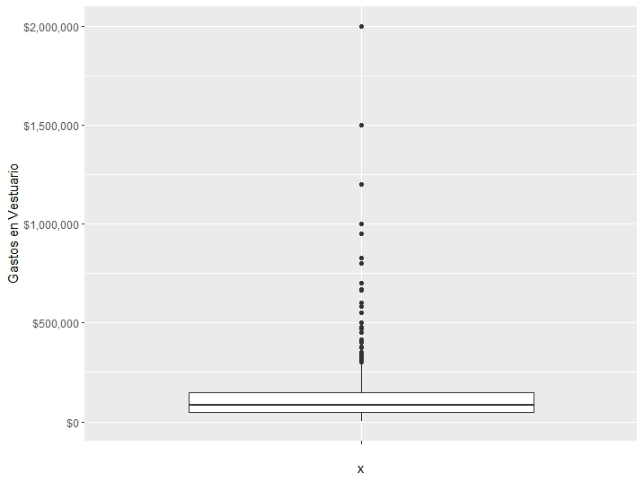

```{r setup, include=FALSE, message= FALSE, warning=FALSE, echo=FALSE, error=FALSE}
knitr::opts_chunk$set(warning = FALSE, message = FALSE)
info.date<-format(Sys.time(), "%Y-%m")
fileConn<-file("footer.html")
msj<-paste("<p>", info.date, "ESTADISTICA DESCRIPTIVA</p>")
writeLines(c(msj,"<p> UPTC.</p>"),fileConn)
close(fileConn)
```

<script>
$(document).ready(function() {
  // Ocultar todas las secciones excepto la primera al cargar la página
  $(".tabcontent").hide();
  $("#introduccion").show();
  
  // Manejar el clic en los botones
  $(".tablink").click(function() {
    // Ocultar todas las secciones
    $(".tabcontent").hide();
    // Mostrar la sección correspondiente
    var tabId = $(this).attr("data-id");
    $("#" + tabId).show();
  });
});
</script>


### _ANÁLISIS EXPLORATORIO UNIVARIADO VAR. CUANTITATIVAS_
Texto Texto


<div class="tab">
  <button class="tablink first-tab" data-id="introduccion">INTRODUCCIÓN</button>
  <button class="tablink" data-id="seccion1">INGRESO</button>
  <button class="tablink" data-id="seccion2">G. ALIMENTACIÓN</button>
  <button class="tablink" data-id="seccion3">G. VESTUARIO</button>
  <button class="tablink" data-id="seccion4">G. RECREACIÓN</button>
</div>


<div id="introduccion" class="tabcontent">
#### SET DE DATOS
Encuesta de Carga Financiera y Educación Financiera de los Hogares - IEFIC-2017 -2018

```{r echo=FALSE}
library(dplyr)
library(scales)
library(data.table)
df_Ct <- fread("Outputs/df_Ct.csv") %>% 
  select(-V1)

df_Ct <- data.table::as.data.table(lapply(df_Ct, as.numeric))
df_Ct$DEPARTAMENTO <- as.character(df_Ct$DEPARTAMENTO)

df_Ct <- df_Ct %>%
  mutate(across(where(is.numeric) & !matches("DEPARTAMENTO"), ~dollar(.)))

str(df_Ct)
```

```{r warning=FALSE}
library(DT)
library(data.table)
DT::datatable(df_Ct, options = list(pageLength = 15))
```

</div>


<div id="seccion1" class="tabcontent">
#### INGRESO TOTAL POR PERSONA
Encuesta de Carga Financiera y Educación Financiera de los Hogares - IEFIC-2017 -2018
```{r include=FALSE}
tf_ingreso <- readRDS("Outputs/tf_ingreso.rds")
str(tf_ingreso)
```

```{r fig.height=15, fig.width=15}
library(DT)
library(data.table)
DT::datatable(tf_ingreso, options = list(pageLength = 15))
```

```{r echo=FALSE, out.width='60%', fig.cap="Fig. 1. Histograma Ingreso del Hogar", fig.align='center'}

```

```{r echo=FALSE, out.width='60%', fig.cap="Fig. 2. Box Plot Ingresos del Hogar", fig.align='center'}
knitr::include_graphics("Outputs/BOX_ingreso.jpeg")
```

```{r}
NUM_5_INGRESO1 <- readRDS("Outputs/NUM_5_INGRESO1.rds")
library(DT)
library(data.table)
DT::datatable(NUM_5_INGRESO1)
```

```{r}
NUM_5_INGRESO2 <- readRDS("Outputs/NUM_5_INGRESO2.rds")
library(DT)
library(data.table)
DT::datatable(NUM_5_INGRESO2)
```

</div>


<div id="seccion2" class="tabcontent">
#### GASTOS DE ALIMENTACIÓN POR HOGAR
Encuesta de Carga Financiera y Educación Financiera de los Hogares - IEFIC-2017 -2018
```{r include=FALSE}
tf_aliment <- readRDS("Outputs/tf_aliment.rds")
str(tf_aliment)
```

```{r fig.height=15, fig.width=15}
library(DT)
library(data.table)
DT::datatable(tf_aliment, options = list(pageLength = 15))
```

```{r echo=FALSE, out.width='60%', fig.cap="Fig. 1. Histograma Ingreso del Hogar", fig.align='center'}

```

```{r echo=FALSE, out.width='60%', fig.cap="Fig. 2. Box Plot Ingresos del Hogar", fig.align='center'}

```

```{r}
NUM_5_ALIMENT1 <- readRDS("Outputs/NUM_5_ALIMENT1.rds")
library(DT)
library(data.table)
DT::datatable(NUM_5_ALIMENT1)
```

```{r}
NUM_5_ALIMENT2 <- readRDS("Outputs/NUM_5_ALIMENT2.rds")
library(DT)
library(data.table)
DT::datatable(NUM_5_ALIMENT2)
```
</div>


<div id="seccion3" class="tabcontent">
#### GASTOS DE VESTUARIO POR HOGAR
Encuesta de Carga Financiera y Educación Financiera de los Hogares - IEFIC-2017 -2018
```{r include=FALSE}
tf_vest <- readRDS("Outputs/tf_vest.rds")
str(tf_vest)
```

```{r fig.height=15, fig.width=15}
library(DT)
library(data.table)
DT::datatable(tf_vest, options = list(pageLength = 15))
```

```{r echo=FALSE, out.width='60%', fig.cap="Fig. 1. Histograma Ingreso del Hogar", fig.align='center'}

```

```{r echo=FALSE, out.width='60%', fig.cap="Fig. 2. Box Plot Ingresos del Hogar", fig.align='center'}

```

```{r}
NUM_5_VEST1 <- readRDS("Outputs/NUM_5_VEST1.rds")
library(DT)
library(data.table)
DT::datatable(NUM_5_VEST1)
```

```{r}
NUM_5_VEST2 <- readRDS("Outputs/NUM_5_VEST2.rds")
library(DT)
library(data.table)
DT::datatable(NUM_5_VEST2)
```
</div>


<div id="seccion4" class="tabcontent">
#### GASTOS DE RECREACIÓN POR HOGAR
Encuesta de Carga Financiera y Educación Financiera de los Hogares - IEFIC-2017 -2018
```{r include=FALSE}
tf_recr <- readRDS("Outputs/tf_recr.rds")
str(tf_recr)
```

```{r fig.height=15, fig.width=15}
library(DT)
library(data.table)
DT::datatable(tf_recr, options = list(pageLength = 15))
```

```{r echo=FALSE, out.width='60%', fig.cap="Fig. 1. Histograma Ingreso del Hogar", fig.align='center'}

```

```{r echo=FALSE, out.width='60%', fig.cap="Fig. 2. Box Plot Ingresos del Hogar", fig.align='center'}

```

```{r}
NUM_5_RECR1 <- readRDS("Outputs/NUM_5_RECR1.rds")
library(DT)
library(data.table)
DT::datatable(NUM_5_RECR1)
```

```{r}
NUM_5_RECR2 <- readRDS("Outputs/NUM_5_RECR2.rds")
library(DT)
library(data.table)
DT::datatable(NUM_5_RECR2)
```
</div>
