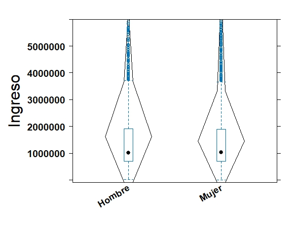
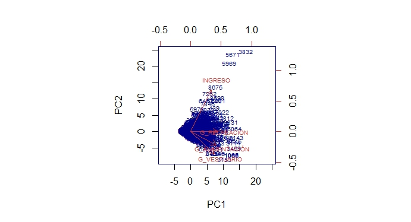
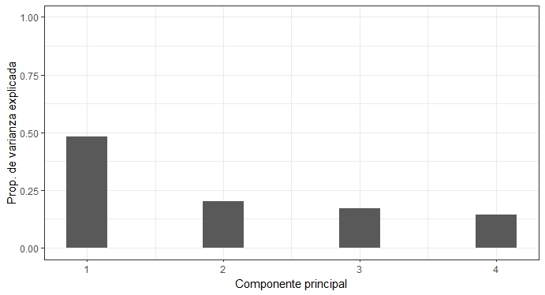
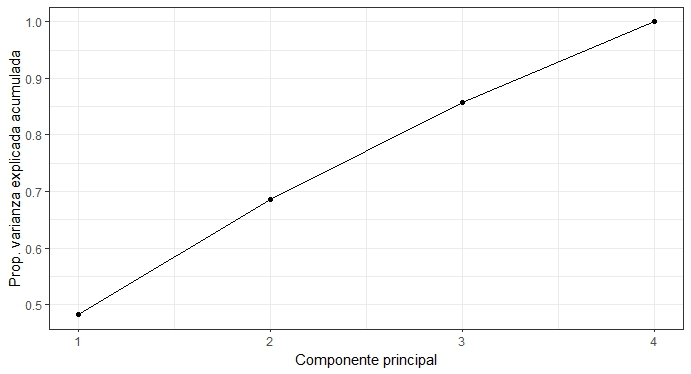

```{r setup, include=FALSE, message= FALSE, warning=FALSE, echo=FALSE, error=FALSE}
knitr::opts_chunk$set(warning = FALSE, message = FALSE)
info.date<-format(Sys.time(), "%Y-%m")
fileConn<-file("footer.html")
msj<-paste("<p>", info.date, "ESTADISTICA DESCRIPTIVA</p>")
writeLines(c(msj,"<p> UPTC.</p>"),fileConn)
close(fileConn)
```

<script>
$(document).ready(function() {
  // Ocultar todas las secciones excepto la primera al cargar la página
  $(".tabcontent").hide();
  $("#introduccion").show();
  
  // Manejar el clic en los botones
  $(".tablink").click(function() {
    // Ocultar todas las secciones
    $(".tabcontent").hide();
    // Mostrar la sección correspondiente
    var tabId = $(this).attr("data-id");
    $("#" + tabId).show();
  });
});
</script>


### _Análisis Multivariado_
Se realizará un análisis de variables cuantitativas y cualitativas por separado, de manera mixta y se concluirá con la palicación de un método multivariado para variables cuantitativas.


<div class="tab">
  <button class="tablink first-tab" data-id="introduccion">INTRODUCCIÓN</button>
  <button class="tablink" data-id="seccion1">CUANTITATIVO</button>
  <button class="tablink" data-id="seccion2">CUALITATIVO</button>
  <button class="tablink" data-id="seccion3">MIXTO</button>
  <button class="tablink" data-id="seccion4">MÉTODO MULTI.</button>
</div>


<div id="introduccion" class="tabcontent">
#### VARIABLES
Encuesta de Carga Financiera y Educación Financiera de los Hogares - IEFIC-2017 -2018

```{r echo=FALSE}
library(dplyr)
library(scales)
library(data.table)
df_MULT <- fread("Outputs/df_Ct.csv")

df_MULT <- data.table::as.data.table(lapply(df_MULT, as.numeric))

df_MULT <- df_MULT %>%
  mutate(across(where(is.numeric)& !matches("DEPARTAMENTO"), ~dollar(.)))

str(df_MULT)
```

```{r warning=FALSE}
library(DT)
library(data.table)
DT::datatable(df_MULT, options = list(pageLength = 15))
```

</div>


<div id="seccion1" class="tabcontent">
#### ANÁLISIS MULTIVARIADO CUANTITATIVO
Encuesta de Carga Financiera y Educación Financiera de los Hogares - IEFIC-2017 -2018

-Ingreso del Hogar
```{r echo=FALSE}
#Resumen estadístico
R_Ingreso <- readRDS("Outputs/R_Ingreso.rds")
R_Ingreso
```
Se evidencia un rango muy amplio entre el valor mínimo y el valor máximo, eviendiandose que el 75% de la población tiene un ingreso menor hasta los COP 1'903.820 millones de pesos colombianos mensuales, quedando un 25% de la población con unos ingresos que llegan hasta los COP 100'000.000.


```{r echo=FALSE}
R_G.Alim <- readRDS("Outputs/R_G.Alim.rds")
R_G.Alim
```
El 75% de los encuestados gastan menos de COP 800.000 en alimentación por el hogar en un mes. 


```{r echo=FALSE}
R_G.Vest <- readRDS("Outputs/R_G.Vest.rds")
R_G.Vest
```
El 75% de la población gasta menos de 150.000 en vestuario al mes.


```{r echo=FALSE}
R_G.Recr <- readRDS("Outputs/R_G.Recr.rds")
R_G.Recr
```
El 75% de la población gasta menos de COP 200.000 en recreación en el mes.


```{r eval=FALSE, include=FALSE}
###MEDIDAS GLOBALES DE VARIABILIDAD
# Cálculo del vector de medias 
vec.med <- (1/9515)*t(df_MULT)%*%rep(1,9515)
```
########### Vector de Medias 
  + Ingreso:                $1'850.630.1
  + Gasto en Alimentación:  $  674.954.6
  + Gasto en Vestuario:     $  118.003.1
  + Gasto en Recreación:    $  175.104.6
```{r}
#Matriz de varianzas y covarianzas
cov_DANE <- readRDS("Outputs/cov_DANE.rds")
cov_DANE
```

```{r}
#varianza total
Dcov_DANE <- readRDS("Outputs/Dcov_DANE.rds")
Dcov_DANE
```

```{r eval=FALSE, include=FALSE}
#varianza promedio
var_prom <- sum(diag(cov_DANE))/4
```
Varianza Promedio: 2547278325390
```{r eval=FALSE, include=FALSE}
#varianza generalizada
determinante <- det(cov_DANE)
determinante
```
Determinante de la matriz: 949137814517897122980064828888448880224062068

```{r eval=FALSE, include=FALSE}
#Desviación típica generalizada
Des_tipG <- sqrt(det(cov_DANE))
```
Deviación típica generalizada: 30808080344576763626662
```{r eval=FALSE, include=FALSE}
#variabilidad promedio
Variab_prom <- (det(cov_DANE))^(1/4)
```
Variabilidad Promedio: 175522307256
```{r eval=FALSE, include=FALSE}
#Desviación Promedio 
Desv_prom <- (det(cov_DANE))^(1/8)
```
Desviación Promedio: $418.953.8


```{r echo=FALSE, out.width='70%', fig.cap="Fig. 1. Diagrama de cajas por variable", fig.align='center'}
knitr::include_graphics("Outputs/Box2-2.jpeg")
```
Al observar el BoxPlot de cada variable se concluye que el Ingreso es la que tiene mayor dispersión en los datos y la variable gastos en recreación la de menor dispersión; también podemos observar que la media del ingreso se encuetra por debajo de cero lo cual indica una cola muy larga en los valores positivos. 


```{r echo=FALSE, out.width='70%', fig.cap="Fig. 2. Prueba de Multinormalidad", fig.align='center'}
knitr::include_graphics("Outputs/MULTINORMALIDAD.jpeg")
```

```{r echo=FALSE, out.width='70%', fig.cap="Fig. 3. Dispersograma", fig.align='center'}
knitr::include_graphics("Outputs/Disp_cuanti.jpeg")
```


```{r echo=FALSE, out.width='70%', fig.cap="Fig. 4. Correlación y Función de Densidad", fig.align='center'}
knitr::include_graphics("Outputs/Cor.Mult.Dens.jpeg")
```

```{r echo=FALSE, out.width='70%', fig.cap="Fig. 5. Correlación", fig.align='center'}
knitr::include_graphics("Outputs/Cor.Cuant.jpeg")
```
La correlación evidencia una baja correlación en cuando al ingreso y el gasto por vestuario, lo cual indica que ambas variables se comportan de una manera similar pero de manera debil; así como la correlación más fuerte que corresponde a los gastos en alimentación con los gastos en recreación los cuales si indican un comportamiento similar entre las variables.

</div>


<div id="seccion2" class="tabcontent">
#### ANÁLISIS BIVARIADO DE VARIABLES CUALITATIVAS
Encuesta de Carga Financiera y Educación Financiera de los Hogares - IEFIC-2017 -2018


###### Tabla de Contigencia Sexo vs Percepción a Pagos electrónicos
```{r echo=FALSE}
#Resumen estadístico
df_MCl <- readRDS("Outputs/df_MCl.rds")
df_MCl
```
Se tomarán las variables P35: Sexo, P3045: Percepción hacia los Pagos Electrónicos, P2439: Tenencia de vivienda.

```{r echo=FALSE}
#Tabla de doble entrada sexo vs Percepción de pagos
tabla.S.Per <- readRDS("Outputs/tabla.S.Per.rds")
library(knitr)
kable(tabla.S.Per)
```
Se puede observar que las mujeres presentaron una mayor paticipación en la encuesta con un 55.77% con respecto a los hombres con un 44.23%, también es identificar que el 26.56% de los encuestados o acepta los métodos de pago electrónico siendo una proporción importante de la encuesta, lo cual indica que pueden estar más cómodos usando otros medios de pago como lo puede ser el efcetivo.


```{r echo=FALSE, out.width='70%', fig.cap="Fig. 6. Contigencia Sexo vs Percepción a Pagos electrónicos", fig.align='center'}
knitr::include_graphics("Outputs/Sexo_Percep.jpeg")
```
En la gráfica se logra apreciar que son las mujeres las que menos aceptan los págos electrónicos con respecto a los hombres en menor medida, en cuanto a las otras categorías de la escala de aceptación se aprecia que la percepción entre hombres y mujeres se mantiene similar en su proporción. 


### Tabla de Contigencia Sexo vs Vivienda Propia
```{r echo=FALSE}
#Resumen estadístico
tabla.S.Viv <- readRDS("Outputs/tabla.S.Viv.rds")
library(knitr)
kable(tabla.S.Viv)
```
la tabla de contingencia nos muestra que la probabilidad de ser mujer y tener vivienda propia 27.48% más alta con respecto a los hombres 21.16%; también se concluye que el 51.35% de los encuestados no poseen vivienda propia.


```{r echo=FALSE, out.width='70%', fig.cap="Fig. 7. Contigencia Sexo vs Vivienda Propia", fig.align='center'}
knitr::include_graphics("Outputs/Sexo_Viv.jpeg")
```

</div>


<div id="seccion3" class="tabcontent">
#### ANÁLISIS MULTIVARIADO MIXTO
Encuesta de Carga Financiera y Educación Financiera de los Hogares - IEFIC-2017

```{r echo=FALSE, out.width='70%', fig.cap="Fig. 8. Violín Ingreso vs Sexo", fig.align='center'}

```
Al comparar la variable Ingreso del Hogar (cuantitativa) con la variable Sexo (cualitativa), se puede observar que la media de ambos sexos se encuentra en la misma zona proporcionalmente, lo que indica que en promedio tanto hombres como mujeres ganan lo mismo. También se puede apreciar que en ambos sexos hay una importante dispersión de los datos en los bigotes del diagrama de caja y bigotes (boxplot), y se puede observar que la mayoría de los hogares tienen un ingreso que oscila entre $1'000.000 y $2'000.000.


```{r echo=FALSE, out.width='70%', fig.cap="Fig. 9. Violín INgreso vs Percepción de pagos Electrónicos", fig.align='center'}
knitr::include_graphics("Outputs/Violín2.jpeg")
```

</div>


<div id="seccion4" class="tabcontent">
#### ANÁLIS DE COMPONENTES PRINCIPALES 
Encuesta de Carga Financiera y Educación Financiera de los Hogares - IEFIC-2017

Para el desarrollo del método de análisis de componenetes principales, se han tomado las variables, *Ingreso total del Hogar,* *Gastos de Alimentación,* *Gastos de Vestuario* y *Gastos en Recreación.* 
```{r echo=FALSE, out.width='70%', fig.cap="Fig. 9. Biplot Análisis de Componentes Principales", fig.align='center'}

```
Se puede observar que el vector correspondiente a la variable Ingreso por Hogar tiene la dirección más positiva y la longitud más amplia. Además, se pueden apreciar algunos valores extremos en la distribución de ingresos de los encuestados, lo cual indica una alta variabilidad en esta variable. Estos valores extremos no se eliminaron o trataron como atípicos, ya que son una característica natural de la variable.

Las variables Gasto en Alimentación y Gasto en Vestuario tienen un comportamiento similar en cuanto a su dirección y magnitud, con pocos valores extremos que indican una baja variabilidad en estos gastos. También se observa la variable Gasto en Recreación, que tiene la menor variabilidad de las cuatro variables, lo que sugiere que los encuestados gastan cantidades más homogéneas en recreación.


```{r echo=FALSE, out.width='70%', fig.cap="Fig. 10. Aporte por componente", fig.align='center'}

```
El método utilizado permite observar la proporción de varianza explicada por cada una de las componentes. En este caso, se encontró que la primera componente explica el 47% de la varianza y la segunda componente el 20%, lo que indica que seleccionar dos componentes principales permitiría conservar el 67% de la varianza de las cuatro variables.


```{r echo=FALSE, out.width='70%', fig.cap="Fig. 11. Número de Componentes", fig.align='center'}

```
De esta manera, también es posible observar el aporte de cada componente cuando se utilizan 1, 2, 3 o 4 componentes. En este caso, se encontró que seleccionar tres componentes sería lo ideal para responder al 85% de la variabilidad de las cuatro variables observadas.

</div>