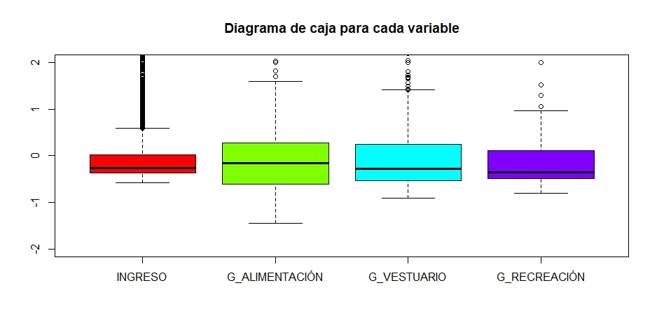
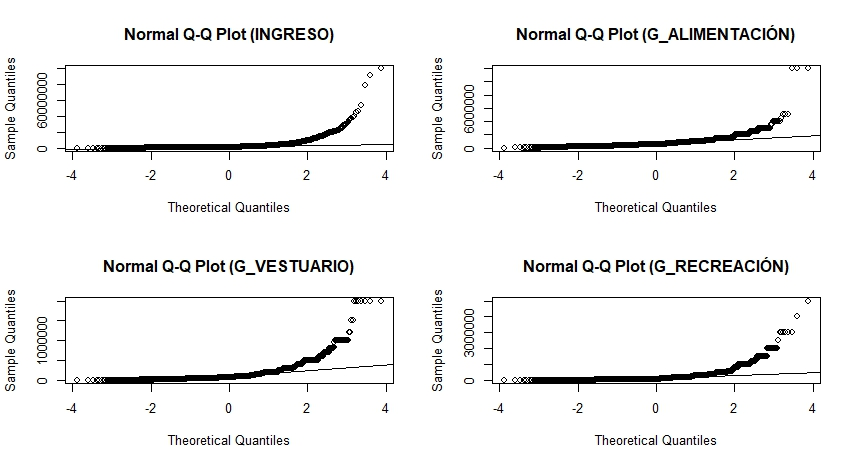
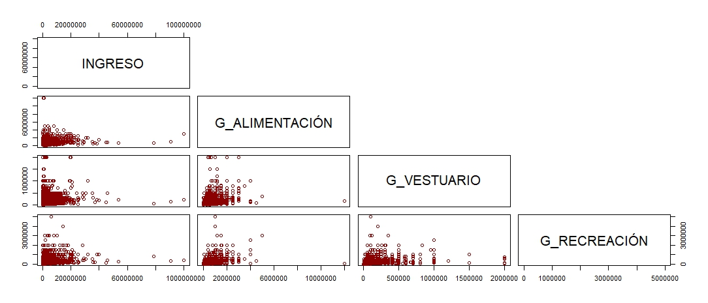
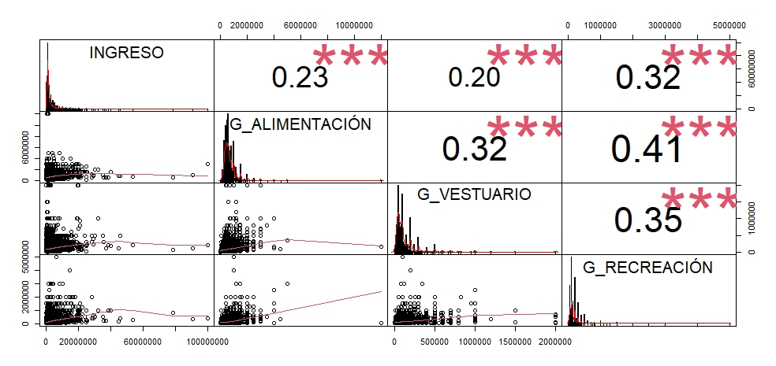
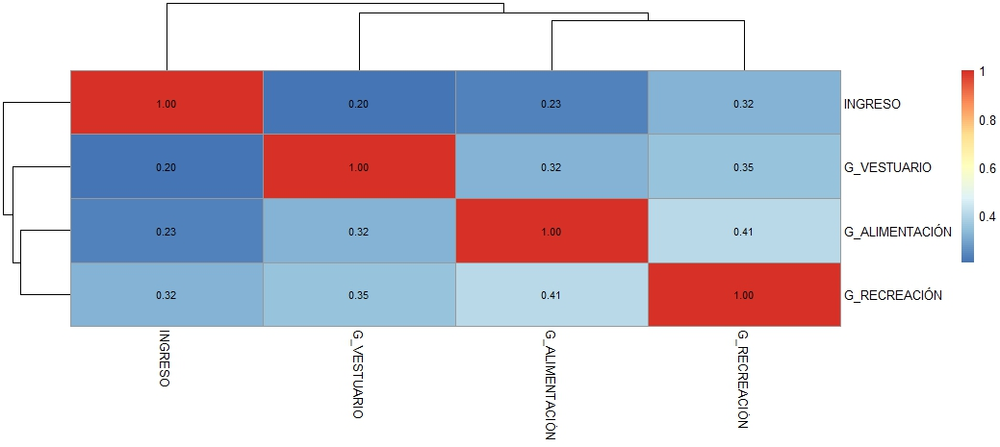
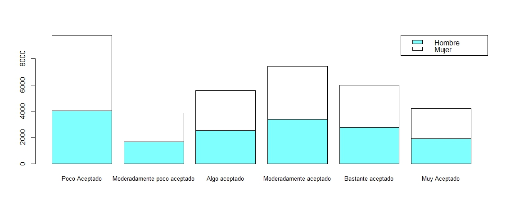
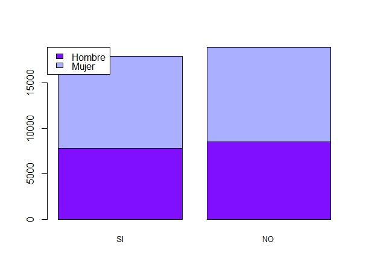

```{r setup, include=FALSE, message= FALSE, warning=FALSE, echo=FALSE, error=FALSE}
knitr::opts_chunk$set(warning = FALSE, message = FALSE)
info.date<-format(Sys.time(), "%Y-%m")
fileConn<-file("footer.html")
msj<-paste("<p>", info.date, "ESTADISTICA DESCRIPTIVA</p>")
writeLines(c(msj,"<p> UPTC.</p>"),fileConn)
close(fileConn)
```

<script>
$(document).ready(function() {
  // Ocultar todas las secciones excepto la primera al cargar la página
  $(".tabcontent").hide();
  $("#introduccion").show();
  
  // Manejar el clic en los botones
  $(".tablink").click(function() {
    // Ocultar todas las secciones
    $(".tabcontent").hide();
    // Mostrar la sección correspondiente
    var tabId = $(this).attr("data-id");
    $("#" + tabId).show();
  });
});
</script>


### _A.E. UNIVARIADO VAR. CUANTITATIVAS_
Texto Texto


<div class="tab">
  <button class="tablink first-tab" data-id="introduccion">INTRODUCCIÓN</button>
  <button class="tablink" data-id="seccion1">CUANTITATIVO</button>
  <button class="tablink" data-id="seccion2">CUALITATIVO</button>
  <button class="tablink" data-id="seccion3">MIXTO</button>
  <button class="tablink" data-id="seccion4">MÉTODO MULTI.</button>
</div>


<div id="introduccion" class="tabcontent">
#### SET DE DATOS
Encuesta de Carga Financiera y Educación Financiera de los Hogares - IEFIC-2017 -2018

```{r echo=FALSE}
library(dplyr)
library(scales)
library(data.table)
df_MULT <- fread("Outputs/df_Ct.csv")

df_MULT <- data.table::as.data.table(lapply(df_MULT, as.numeric))

df_MULT <- df_MULT %>%
  mutate(across(where(is.numeric)& !matches("DEPARTAMENTO"), ~dollar(.)))

str(df_MULT)
```

```{r warning=FALSE}
library(DT)
library(data.table)
DT::datatable(df_MULT, options = list(pageLength = 15))
```

</div>


<div id="seccion1" class="tabcontent">
#### SET DE DATOS
Encuesta de Carga Financiera y Educación Financiera de los Hogares - IEFIC-2017 -2018

```{r echo=FALSE}
#Resumen estadístico
R_Ingreso <- readRDS("Outputs/R_Ingreso.rds")
R_Ingreso
```

```{r}
R_G.Alim <- readRDS("Outputs/R_G.Alim.rds")
R_G.Alim
```

```{r}
R_G.Vest <- readRDS("Outputs/R_G.Vest.rds")
R_G.Vest
```

```{r}
R_G.Recr <- readRDS("Outputs/R_G.Recr.rds")
R_G.Recr
```

```{r eval=FALSE, include=FALSE}
###MEDIDAS GLOBALES DE VARIABILIDAD
# Cálculo del vector de medias 
vec.med <- (1/9515)*t(df_MULT)%*%rep(1,9515)
```
Vector de Medias 
  Ingreso:                $1'850.630.1
  Gasto en Alimentación:  $  674.954.6
  Gasto en Vestuario:     $  118.003.1
  Gasto en Recreación:    $  175.104.6
```{r}
#Matriz de varianzas y covarianzas
cov_DANE <- readRDS("Outputs/cov_DANE.rds")
cov_DANE
```

```{r}
#varianza total
Dcov_DANE <- readRDS("Outputs/Dcov_DANE.rds")
Dcov_DANE
```

```{r eval=FALSE, include=FALSE}
#varianza promedio
var_prom <- sum(diag(cov_DANE))/4
```
Varianza Promedio: 2547278325390
```{r eval=FALSE, include=FALSE}
#varianza generalizada
determinante <- det(cov_DANE)
determinante
```
Determinante de la matriz: 949137814517897122980064828888448880224062068

```{r eval=FALSE, include=FALSE}
#Desviación típica generalizada
Des_tipG <- sqrt(det(cov_DANE))
```
Deviación típica generalizada: 30808080344576763626662
```{r eval=FALSE, include=FALSE}
#variabilidad promedio
Variab_prom <- (det(cov_DANE))^(1/4)
```
Variabilidad Promedio: 175522307256
```{r eval=FALSE, include=FALSE}
#Desviación Promedio 
Desv_prom <- (det(cov_DANE))^(1/8)
```
Desviación Promedio: $418.953.8


```{r echo=FALSE, out.width='70%', fig.cap="Fig. 1. Diagrama de cajas por variable", fig.align='center'}

```

```{r echo=FALSE, out.width='70%', fig.cap="Fig. 2. Prueba de Multinormalidad", fig.align='center'}

```

```{r echo=FALSE, out.width='70%', fig.cap="Fig. 3. Dispersograma", fig.align='center'}

```


```{r echo=FALSE, out.width='70%', fig.cap="Fig. 4. Correlación y Función de Densidad", fig.align='center'}

```

```{r echo=FALSE, out.width='70%', fig.cap="Fig. 5. Correlación", fig.align='center'}

```
</div>


<div id="seccion2" class="tabcontent">
#### SET DE DATOS
Encuesta de Carga Financiera y Educación Financiera de los Hogares - IEFIC-2017 -2018

```{r echo=FALSE}
#Resumen estadístico
df_MCl <- readRDS("Outputs/df_MCl.rds")
df_MCl
```

```{r echo=FALSE}
#Resumen estadístico
tabla.S.Per <- readRDS("Outputs/tabla.S.Per.rds")
tabla.S.Per
```

```{r echo=FALSE}
#Resumen estadístico
tabla.S.Viv <- readRDS("Outputs/tabla.S.Viv.rds")
tabla.S.Viv
```

```{r echo=FALSE, out.width='70%', fig.cap="Fig. 5. Correlación", fig.align='center'}

```

```{r echo=FALSE, out.width='70%', fig.cap="Fig. 5. Correlación", fig.align='center'}

```
</div>

